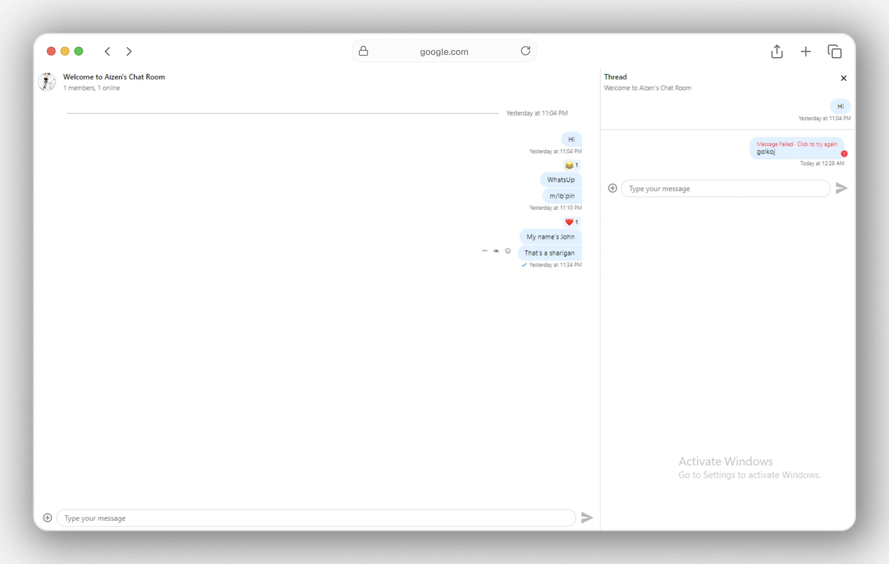

<p align="center">
    <a href="#" style="display: block;" align="center">
        
    </a>
</p>

## Getting started with Strean Phase 1 
<p align="center">
    <a href="#" style="display: block;" align="center">
        
    </a>
</p>

## Project Setup and Installation
The easiest way to build a Stream Chat React JS application s to create a new project using Vite. 
Vite allows you create a boilerplate React application that you can run locally with just a few simple commands.

```shell
C:\Users\USER\Desktop\Stream-ChatApplication>npm create vite@latest

> npx
> create-vite

√ Project name: ... .
√ Package name: ... stream-chatapplication
√ Select a framework: » React
√ Select a variant: » TypeScript

Scaffolding project in C:\Users\USER\Desktop\Stream-ChatApplication...

Done. Now run:

  npm install
  npm run dev


C:\Users\USER\Desktop\Stream-ChatApplication>npm install

added 181 packages, and audited 182 packages in 3m

43 packages are looking for funding
  run `npm fund` for details

found 0 vulnerabilities
```

## Setup Stream SDK

```shell
C:\Users\USER\Desktop\Stream-ChatApplication>npm i stream-chat stream-chat-react

added 241 packages, and audited 423 packages in 4m

154 packages are looking for funding
  run `npm fund` for details

found 0 vulnerabilities
```
## Getting started with Strean Phase 1 
<p align="center">
    <a href="#" style="display: block;" align="center">
        
    </a>
</p>

# Setting up the client setup
Before starting to work with the UI components We have to setup a `StreamChat` client which abstracts (the process of simplifying complex systems by removing unnecessary details and focusing on the most important elements) the API calls into methods, handles and real time events.

<p align="center">
    <a href="#" style="display: block;" align="center">
        
    </a>
</p>

Instantanting and making the connection handling easier, we'll prepare a simple hook `useCreateChatClient` we can only use this hook once per application 

# The initial setup for core components 
Congratulations ✨ Now that our client connection has been established  It's time to build the actual app interactable. 
I'll be creating a base setup which we'll modyfying and expanding.
This initial setup will be built using the list of components
- Chat
- Channel
- ChannelHeader
- MessageInput (with EmojiPicker & emoji autocomplete)
- MessageList
- Thread
- Window

The `chat` and `channel` components are React context providers that pass a variety of values to their children, including UI components, channel state data, and messaging functions.
The channel type determines the enabled features and permissions associated with this channel. 

```typescript
<Chat client={client}>
      <Channel channel={channel}>
        <Window>
          <ChannelHeader />
          <MessageList />
          <MessageInput />
        </Window>
        <Thread />
      </Channel>
    </Chat>
```

Once you have the app running, they'll be the folloeing out-of-box features



1. User online presence
2. Typing indicators
3. Message status indicators (sending, received)
4. User role configuration
5. Emoji support (opt-in)
6. Message read indicators
7. Threading and message replies
8. Message reactions

# React + TypeScript + Vite

This template provides a minimal setup to get React working in Vite with HMR and some ESLint rules.

Currently, two official plugins are available:

- [@vitejs/plugin-react](https://github.com/vitejs/vite-plugin-react/blob/main/packages/plugin-react/README.md) uses [Babel](https://babeljs.io/) for Fast Refresh
- [@vitejs/plugin-react-swc](https://github.com/vitejs/vite-plugin-react-swc) uses [SWC](https://swc.rs/) for Fast Refresh

## Expanding the ESLint configuration

If you are developing a production application, we recommend updating the configuration to enable type aware lint rules:

- Configure the top-level `parserOptions` property like this:

```js
export default tseslint.config({
  languageOptions: {
    // other options...
    parserOptions: {
      project: ['./tsconfig.node.json', './tsconfig.app.json'],
      tsconfigRootDir: import.meta.dirname,
    },
  },
})
```

- Replace `tseslint.configs.recommended` to `tseslint.configs.recommendedTypeChecked` or `tseslint.configs.strictTypeChecked`
- Optionally add `...tseslint.configs.stylisticTypeChecked`
- Install [eslint-plugin-react](https://github.com/jsx-eslint/eslint-plugin-react) and update the config:

```js
// eslint.config.js
import react from 'eslint-plugin-react'

export default tseslint.config({
  // Set the react version
  settings: { react: { version: '18.3' } },
  plugins: {
    // Add the react plugin
    react,
  },
  rules: {
    // other rules...
    // Enable its recommended rules
    ...react.configs.recommended.rules,
    ...react.configs['jsx-runtime'].rules,
  },
})
```
